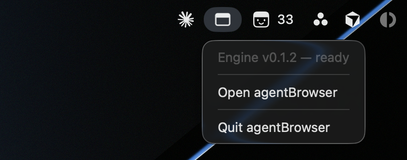
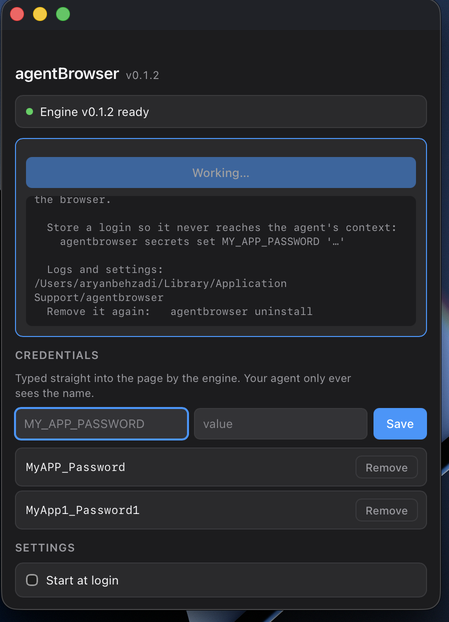
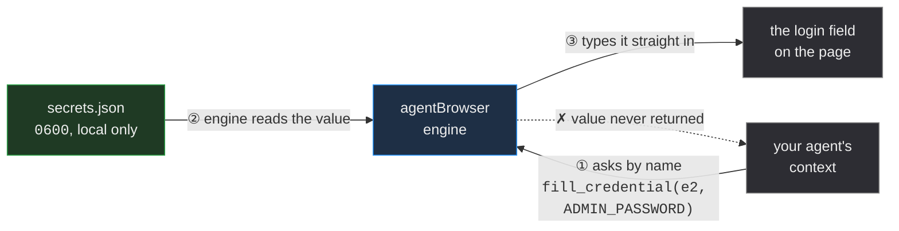

<div align="center">


# agentBrowser

**A headless browser your coding agent can actually finish a job in.**

Claude Code and Codex get a real Chromium they drive from the outside — with none of the restrictions browsers place on in-page automation. So they can log into your internal tools, fill the forms, **upload the file**, and be done.


</div>

---

## Why this exists

We wanted Claude to do a genuinely boring job: log into our internal admin tool, find a record, and attach a document. It got about 80% of the way and then stopped dead — every single time, at the same step.

**The upload.**

Browsers require a real human gesture before opening a file picker. That's not a bug or an oversight; it's a deliberate anti-abuse protection, and it's absolute. An agent working through a browser extension or injected JavaScript **cannot** attach a file to `<input type="file">`. No amount of cleverness gets around it, because the whole point of the restriction is that no amount of cleverness should.

Which meant our agent could do the interesting 80% and then hand the task back to a human for the tedious 20%. Worse than useless — it created work.

The fix turned out to be a change of vantage point. The restriction applies to code running *inside* the page. Drive Chromium from *outside*, over the DevTools Protocol, and setting a file on an input is an ordinary operation — no gesture required, because there's no page-level JavaScript asking for one.

That outside-the-page control comes from **[Playwright](https://playwright.dev)**, which is what makes the whole thing possible. agentBrowser is the layer on top: an interface an agent can reason about, credentials it never gets to see, and a single binary you can hand to someone.

That one shift unlocks the rest of the list that in-page automation can't reach:

| | In-page automation | agentBrowser |
| --- | :---: | :---: |
| Click, type, read the DOM | ✅ | ✅ |
| **Attach a local file to an upload field** | ❌ | ✅ |
| Reach into cross-origin iframes | ❌ | ✅ |
| Capture downloads the site triggers | ❌ | ✅ |
| Handle native `confirm()` / `alert()` dialogs | ❌ | ✅ |
| Run with no browser window, on a schedule | ❌ | ✅ |

So agentBrowser is a browser that belongs to your agent, not to you — and a small menu bar app to install it, keep it current, and hold the passwords it needs without ever showing them to the agent.

---

## What it looks like

<div align="center">



<sub>**Lives in the menu bar, never the Dock.** The menu reports which engine build your agents are actually running.</sub>

<br><br>



<sub>**First run wires it into Claude Code and Codex**, fetching a browser if you need one. Store a login once and the agent only ever learns its name.</sub>

</div>

---

## Install

**The app** — download the latest `.dmg` from [Releases](https://github.com/ig-shadow-walker/agentBrowser/releases), drag to Applications, open it. Signed and notarized, so no Gatekeeper warnings. First launch connects it to Claude Code and Codex and fetches a browser if you need one.

**Or just the engine**, if you only want the CLI and MCP server:

```bash
curl -fsSL https://raw.githubusercontent.com/ig-shadow-walker/agentBrowser/main/scripts/install.sh | bash
```

Either way: **no Node.js, no Python, no dependencies.** The engine is a single self-contained binary. Restart your agent afterwards so it picks up the new tools.

---

## How an agent uses it

There's nothing to invoke. Ask in plain language:

> Log into `internal.example.com` as admin using the stored `ADMIN_PASSWORD`, open Reports, and upload `~/Documents/q3.pdf`.

Under the hood the agent works in a loop: **look, act by reference, look again.** It asks for a *snapshot* — a compact list of everything on the page it can interact with, each tagged with an id:

```
Page: https://internal.example.com/
Title: Internal Tool Login

- heading "Internal Tool Login" (level=1)
- form
  - text "Username"
  - textbox "Username" [ref=e1]
  - text "Password"
  - textbox "Password" [ref=e2]
  - button "Sign in" [ref=e3]
```

Then acts on those ids — `type("e1", "admin")`, `fill_credential("e2", "ADMIN_PASSWORD")`, `click("e3")`. Far cheaper and far more reliable than screenshots and pixel coordinates, though it can take screenshots too when the visual rendering is what matters.

### The safety detail that matters most

Every snapshot is stamped with a token identifying that exact document. If the page navigates or re-renders, ids from the old snapshot are **refused**:

```
Refs are stale — the page changed since the last snapshot.
Call snapshot() again to get fresh refs.
```

An agent clicking the wrong control on a live internal system is the worst failure available here. Refusing beats guessing.

---

## Credentials never reach your agent

```bash
agentbrowser secrets set ADMIN_PASSWORD 'your-password'
```

Or type it into the app's panel. Then the agent uses it **by name**:

```
fill_credential(ref="e2", secret_name="ADMIN_PASSWORD")
```

The engine looks the value up itself and types it straight into the page. It's never returned to the agent, never enters the chat transcript, never lands in the log:

```
Filled input "Password" [e2] with secret "ADMIN_PASSWORD" (value not shown).
```

Three further precautions, because one layer isn't enough:

- Passwords already typed into a field read back as `«hidden»` in snapshots
- The audit log is scrubbed against every stored value — so a password stays out even if an agent typed it through the generic `type` action by mistake
- Values are passed as separate process arguments, never interpolated into a shell string, so `$`, quotes and backticks in a password are harmless

Stored at `~/Library/Application Support/agentbrowser/secrets.json`, mode `0600`. Nothing leaves your machine.

> **The store is plaintext, not the Keychain.** `0600` keeps out other user accounts, not other processes running as you. See [Security](#security) for what that does and does not protect — including the one thing an agent can still do with a credential it cannot read.

---

## Every action

25 actions, each available identically as an MCP tool and a CLI subcommand.

| | |
| --- | --- |
| **Move** | `navigate` `go_back` `go_forward` `reload` |
| **See** | `snapshot` `screenshot` `get_text` |
| **Interact** | `click` `hover` `press_key` `scroll` |
| **Forms** | `type` `select_option` `set_checked` |
| **Secrets** | `fill_credential` `list_secrets` |
| **Files** | `upload_file` `list_downloads` |
| **Timing** | `wait_for` |
| **Escape hatch** | `evaluate` |
| **Tabs** | `list_tabs` `new_tab` `select_tab` `close_tab` |
| **Session** | `reset_session` |

`upload_file` handles both a plain `<input type="file">` **and** the common pattern where a styled button opens a hidden picker — pass whichever element the snapshot shows you.

### From the terminal

Everything the agent can do, you can do — useful for testing a flow before handing it over:

```bash
agentbrowser navigate internal.example.com
agentbrowser snapshot
agentbrowser type e1 admin
agentbrowser fill_credential e2 ADMIN_PASSWORD --submit
agentbrowser upload_file e12 ~/Documents/q3.pdf
agentbrowser close
```

Commands share one browser session, so the page stays put between them.

---

## How it's built

```
src/                   the engine — TypeScript, ~3k lines, compiled to one binary
  core/actions.ts      every action defined once, with a zod schema
  core/snapshot.ts     the DOM walker and ref system
  core/session.ts      Playwright lifecycle, all page actions
  core/secrets.ts      credential store and log scrubbing
  mcp/                 MCP stdio server        ← how agents call it
  cli/                 CLI + session daemon    ← how you call it
app/                   the menu bar app — Tauri v2, Rust + web UI
  src-tauri/           tray, panel, engine invocation
test/                  four suites, ~750 lines
```

**Actions are declared once.** The MCP server turns each into a tool; the CLI turns each into a subcommand. Both validate against the same schema, so the two interfaces cannot drift apart.

**The app is a control panel, not a runtime.** Claude Code launches the engine itself — that's how MCP works. Quit the app and your agent keeps working. The app exists to install, update, and hold credentials.

**The app stores nothing itself.** Every credential operation shells out to the same CLI you'd type. No second copy of the storage format, no way for the app and terminal to disagree.

### Decisions worth knowing about

Some of these were learned the hard way, and the reasoning is worth more than the code:

<details>
<summary><b>Why content hashes, not version numbers, decide "is your engine current?"</b></summary>

<br>

The app ships its own copy of the engine and needs to know whether the one your agents actually run is the same build. Comparing version strings only works if every change remembers to bump the version — and the one time it's forgotten, the app confidently reports "up to date" while agents run something else.

So it compares the bytes. File length first (settles most cases instantly), then SHA-256 only when lengths match. ~200ms for 72MB, and no discipline required to stay correct.
</details>

<details>
<summary><b>Why the compiled binary carries two Playwright files inside it</b></summary>

<br>

`playwright-core` locates its own `package.json` and `browsers.json` with `require(path.join(__dirname, ".."))`. Bun compiles `__dirname` to the *build machine's* absolute path and can't bundle a computed `require` — so both lookups fail on every machine except the one that built it.

A release shipped broken exactly this way. Now the build embeds both files and writes them out at startup, and `scripts/patch-bundle.mjs` **fails the build** if Playwright's internals change so the patch stops matching. A loud build failure beats a binary that works nowhere.
</details>

<details>
<summary><b>Why one test hides node_modules before running</b></summary>

<br>

`test/standalone-smoke.mjs` runs the binary with `playwright-core` renamed away — which is what every user's machine looks like. Every other suite runs on the build machine, where the files happen to sit at exactly the path baked into the binary, so a lookup that fails everywhere else succeeds there.

Two releases shipped broken before this test existed. It's the reason `scripts/release.sh` builds in a throwaway clone rather than your working tree.
</details>

<details>
<summary><b>Why the browser falls back to Google Chrome</b></summary>

<br>

Playwright's downloader runs the actual fetch in a forked helper process, which doesn't exist inside a single-file compiled binary — so a fresh machine can't always self-install a browser. Rather than reimplement Playwright's CDN layout (which changed format mid-version while this was being built), the engine tries its pinned Chromium, then a system Google Chrome, then Edge.

The full test suite passes with zero Playwright browsers installed, running on system Chrome.
</details>

<details>
<summary><b>Why sessions deliberately don't persist</b></summary>

<br>

Every session starts with no cookies and no storage, and nothing is written to a browser profile on disk. Each task authenticates from scratch, and nothing leaks between tasks. It costs a login per task and buys the guarantee that an agent can never inherit a session you forgot about.
</details>

---

## Auditing what it did

Every action is appended to a local log — what ran, against which URL, whether it succeeded:

```bash
agentbrowser audit 50
```

```json
{"ts":"2026-08-11T12:42:01.113Z","action":"upload_file","via":"cli","args":{"ref":"e1","paths":["/tmp/q3-report.txt"]},"ok":true,"ms":32}
```

This runs against real internal systems with real credentials. The log is how you check what an agent actually did, and credential values never appear in it.

---

## Security

This tool holds real passwords for real internal systems and hands a browser to a language model. It's worth being precise about what that does and doesn't protect.

### How a password travels



The agent names a secret; it never receives one. All it gets back is a confirmation:

```
Filled input "Password" [e2] with secret "ADMIN_PASSWORD" (value not shown).
```

### What is protected

| | |
| --- | --- |
| **Agent context** | Values are never returned by any action, so they can't reach the transcript, a model provider, or a log of the conversation. |
| **Snapshots** | A password already typed into a field reads back as `«hidden»`, so it can't leak through a later `snapshot`. |
| **Audit log** | Scrubbed against every stored value, so a password stays out even if an agent typed it through the generic `type` action by mistake. |
| **Shell metacharacters** | Values are passed as separate process arguments, never interpolated into a shell string — `$`, quotes and backticks in a password are inert. |
| **File permissions** | `secrets.json` and `audit.log` are `0600`, inside a `0700` directory. Verified, not assumed. |
| **Network** | There is none. No server, no account, no telemetry, no remote component. |
| **Code integrity** | Signed with a Developer ID and notarized, hardened runtime enabled. |

### What is *not* protected — read this part

**The store is plaintext JSON, not encrypted.** `0600` stops other user accounts; it does nothing against anything running as you. Another tool, an `npm install` postinstall script, or a second agent can read the file. It is not the macOS Keychain and does not pretend to be.

**Turn on FileVault.** Without it, the file is readable by anyone who takes the disk out of the machine. This is the single highest-value thing you can do, and it takes one setting.

**An agent can't read your password, but it does choose where to put it.** `fill_credential` stops the value entering the agent's reasoning — it does not make the agent trustworthy about *which field* to fill. A prompt-injected agent, or one that has wandered onto an attacker-controlled page, can be persuaded to type your admin password into a form that isn't yours. Nothing in this design prevents that.

That is the real threat model, and the mitigations are operational rather than technical:

- **Scope credentials to the task.** A read-only reporting account, not your admin login. This limits the damage of both a confused agent and a compromised one.
- **Read the audit log after anything sensitive.** It records which secret was used, on which URL. `agentbrowser audit 50`.
- **Treat page content as untrusted.** Text on a page an agent visits is data, not instructions — that holds for the agent driving this browser exactly as it holds anywhere else.

**Writing a secret exposes it briefly to `ps`.** `agentbrowser secrets set NAME VALUE` passes the value as a process argument, so it is visible to other processes owned by you for the duration of that one call. Reading is unaffected — `fill_credential` never passes the value on a command line.

### If you want encryption at rest

The store is deliberately a plain file so the app and CLI share one implementation and cannot disagree about what is stored. Moving to the macOS Keychain would add encryption at rest and per-application access control, at the cost of a migration path and a second code path. It is a reasonable thing to want; it is not what this does today.

---

## Development

```bash
npm install
npx playwright install chromium

npm run build          # TypeScript -> dist/
npm test               # both engine suites against the dev build
npm run compile        # standalone binaries -> build/
npm run test:binary    # all four suites against the compiled binary

cd app && npm install
npm run tauri dev      # the app, with live reload
```

| Suite | Covers |
| --- | --- |
| `test/smoke.mjs` | The engine through the CLI — login, both upload styles, stale-ref refusal, audit scrubbing |
| `test/mcp-smoke.mjs` | The MCP wiring an agent sees — tool discovery, content blocks, error recovery |
| `test/install-smoke.mjs` | Download → run → installed → registered → uninstall, in a sandboxed `HOME` |
| `test/standalone-smoke.mjs` | The binary with `playwright-core` hidden — proves it is genuinely self-contained |

All four run against a fixture "internal app" with a login form and two upload paths, including the hidden-input pattern.

### Releasing

```bash
bash scripts/release.sh 0.1.4          # engine: clean-room build, test, publish
bash app/scripts/sign-and-notarize.sh  # app: sign, notarize, staple, verify
```

`release.sh` builds and tests in a **fresh clone**, not your working tree, and refuses to publish unless all four suites pass. That's not ceremony — both previously broken releases came from building against a dev machine's `node_modules`.

See [`app/README.md`](app/README.md) for the app's internals.

---

## Troubleshooting

| Symptom | Fix |
| --- | --- |
| `agentbrowser: command not found` | `echo 'export PATH="$HOME/.local/bin:$PATH"' >> ~/.zshrc && exec $SHELL` |
| Agent doesn't see the tools | Restart it completely — tool config is read at startup. Then `claude mcp list`. |
| `No usable Chromium found` | `agentbrowser install-browser`, or just install Google Chrome |
| "Refs are stale" | Working as intended. Take a fresh snapshot. |
| Something went wrong | `agentbrowser audit 50` — every action, in order |
| Full diagnostic | `agentbrowser doctor` |

---

## Built with

| | |
| --- | --- |
| **[Playwright](https://playwright.dev)** | Drives Chromium over the DevTools Protocol. The capability this whole project rests on — everything else here is the layer that makes it usable by an agent. |
| **[Tauri](https://tauri.app)** | The menu bar app. ~4MB of Rust rather than a bundled second browser. |
| **[Bun](https://bun.sh)** | Compiles the engine into one self-contained binary, so users need no Node.js. |
| **[Model Context Protocol](https://modelcontextprotocol.io)** | How Claude Code and Codex discover and call the tools. |

---

<div align="center">
<sub>macOS 13+. Built because an agent that gets 80% of the way through a task creates work instead of saving it.</sub>
</div>
